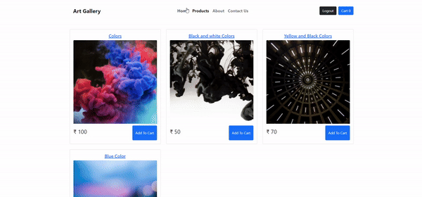

# Art Galley E-Commerce Website



## Live Demo

Check out the live demo [here](https://art-products.netlify.app/).

Welcome to Art Galley, your go-to destination for vibrant color boards! This e-commerce website is built using React, deployed on Netlify, and powered by Firebase for authentication and real-time database functionality. Art Galley offers a seamless shopping experience with user-specific carts and a secure login system.

## Features

- **User Authentication:** Log in to explore a personalized shopping experience. The demo credentials are:
  - Email: test@test.com
  - Password: 123456

- **Protected Routes:** Certain sections of the website, including the product viewing and cart tabs, are accessible only to logged-in users.

- **Firebase Realtime Database:** Your cart data is securely stored and synchronized in real-time using Firebase, ensuring a seamless shopping experience.

- **Token-Based Security:** To enhance security, the app checks Firebase authentication tokens before allowing users to add items to their carts. If the token is expired, users will not be able to add items into cart.

- **Context API:** The application utilizes React's Context API to manage global state, providing a streamlined way to share data among components.

- **React Router:** Navigation is smooth and user-friendly, thanks to React Router, enabling a single-page application feel without unnecessary page reloads.

## Getting Started

To run the project locally, follow these steps:

1. Clone the repository:
   ```bash
   git clone https://github.com/rishii-27/e-commerce.git

2. **Navigate to the project directory:**

    ```bash
    cd e-commerce
    ```

3. **Install dependencies:**

    ```bash
    npm install
    ```

4. **Start the development server:**

    ```bash
    npm start
    ```

5. **Open your browser and visit** [http://localhost:3000](http://localhost:3000) **to view the app.**
